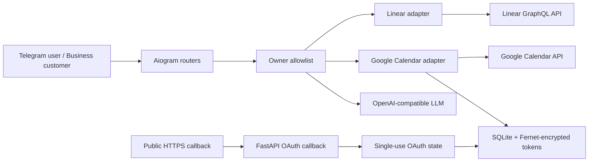

# Предрелизный аудит — 2026-09-04

## Итог

Статус кода: **условный GO для release candidate**. Все найденные блокирующие
дефекты исправлены, локальные quality gates проходят. Итоговая оценка —
**88/100 (B+)**.

Production GO остаётся условным до проверки реального окружения: Docker Engine,
HTTPS reverse proxy, OAuth callback, живые Telegram/Google/Linear/LLM credentials,
резервное копирование и восстановление SQLite.

## Объём и методика

Проверены весь текущий Git working tree, 25 production-модулей `src/`, 14 тестовых
модулей, конфигурация, Dockerfile, Makefile, README, `pyproject.toml`, `uv.lock` и
новая CI-конфигурация. Использованы ручной data-flow review, security scan,
Ruff, strict mypy, pytest с branch coverage, Bandit, pip-audit/OSV и
detect-secrets.

Не выполнялись destructive/live операции во внешних аккаунтах. `.env`, локальная
SQLite-база, production proxy и production logs намеренно не читались.

## Архитектура и границы доверия

Критичные активы: owner identity, Telegram/LLM/Linear credentials, Google refresh
tokens, календарные события, Linear issues и доступность SQLite. Главная граница
авторизации — `TELEGRAM_ALLOWED_USER_ID`; внешние API и LLM output считаются
недоверенными данными.

## Найдено и исправлено

| ID | До исправления | Риск | Исправление | Проверка |
| --- | --- | --- | --- | --- |
| SEC-01 | Calendar router не проверял owner allowlist | Medium, CWE-862 | `allowed_user_id` применяется ко всем calendar commands и callbacks | Негативная матрица для 3 команд и 4 callback-типов |
| SEC-02 | Истёкшие OAuth states и pending operations не удалялись | Low, CWE-400/CWE-459 | Индексы TTL, purge на startup/insert, один актуальный OAuth state и bounded selection batch | Storage expiry, restart и invalidation tests |
| BUG-01 | Google event ID до 1024 символов попадал в Telegram callback_data с лимитом 64 байта | Medium | В callback хранится короткий случайный, user-bound, одноразовый token; event ID остаётся в SQLite | Регрессия с event ID длиной 1024 |
| BUG-02 | Некорректный ответ Google мог выбросить `KeyError`/`AttributeError`/`ValueError` наружу | Medium | Централизованная проверка структуры и типов с `CalendarError` | Malformed payload matrix |
| BUG-03 | Polling и Uvicorn конкурировали за signal handling; завершение одного сервиса не останавливало второй | Medium | Единый supervisor, один signal owner, bounded Telegram concurrency, sibling cancellation и гарантированное закрытие clients | Normal stop, child failure и parent cancellation tests |
| BUG-04 | LLM/calendar response мог превысить Telegram limit 4096 | Medium | Разбиение текста по строкам/жёсткому лимиту, keyboard только на последнем chunk | Boundary и integration tests |
| HARD-01 | OAuth code мог попасть в Uvicorn access log; callback HTML допускал кэширование | Low | Access log отключён для callback service; `no-store`, CSP, no-referrer и nosniff headers | ASGI response tests |
| HARD-02 | Пустые/опасные runtime settings принимались до первого API вызова | Medium | Fail-fast validation: non-empty secrets, positive owner ID, port range, IANA timezone, HTTPS вне loopback, Fernet key | 22 config tests |
| OPS-01 | Не было обязательного CI/coverage/SCA gate | Medium | GitHub Actions, SHA-pinned actions, 90% coverage floor, Ruff, mypy, pytest, Bandit, pip-audit и Dependabot | Локальный эквивалент прошёл |

Исходный security scan зафиксировал 2 reportable findings (SEC-01 и SEC-02) на
доремедиационном snapshot. Оба закрыты кодом и регрессионными тестами в текущем
working tree.

## Risk register после remediation

Шкала: likelihood × impact, от 1 до 25.

| Риск | Было | Остаток | Статус/владелец |
| --- | ---: | ---: | --- |
| Неавторизованный доступ к Calendar integration | 12 | 2 | Закрыт в коде / backend |
| Рост ephemeral SQLite rows | 6 | 1 | Закрыт TTL purge и bounded active state / backend |
| Невалидные callback/data payloads | 8 | 2 | Закрыт token indirection и validation / backend |
| Некорректное завершение двух async services | 9 | 2 | Закрыт supervisor / backend |
| Известная CVE в Python dependency | 8 | 2 | OSV clean + CI/Dependabot / DevOps |
| Утечка OAuth code через внешний proxy log | 9 | 6 | Uvicorn закрыт; proxy не предоставлен / DevOps |
| Ошибка реальной интеграции или scopes | 8 | 6 | Mock/contract tests есть; нужен live smoke / release owner |
| Потеря persistent SQLite volume | 8 | 8 | Backup/restore процедура не предоставлена / operations |
| Privacy/retention обязательства для Business messages | 6 | 6 | Нужна policy по фактической юрисдикции / product owner |

## Оценки по направлениям

| Направление | Балл | Обоснование |
| --- | ---: | --- |
| Backend | 91 | Явные ports/adapters, typed errors, timeouts, bounded concurrency |
| Architecture | 88 | Хорошее разделение domain/application/infrastructure; composition root остаётся крупным |
| Security | 93 | Owner boundary, encrypted tokens, single-use state, hardened callback, clean SAST/SCA |
| QA | 92 | 245 тестов и 93,97% branch coverage; нет live E2E |
| Database | 89 | Parameterized SQL, user scoping, atomic DELETE RETURNING, TTL lifecycle; нет backup proof |
| DevOps | 83 | Non-root image и CI gates; локальный Docker daemon недоступен, deployment config отсутствует |
| AI/LLM | 82 | Pydantic validation и constrained actions; нет adversarial/live eval suite |
| Документация | 87 | Setup и integrations описаны; runbook/rollback пока ограничены |
| Privacy/legal | 64 | Нет policy/retention register; применимость зависит от режима использования |
| Release management | 82 | Автоматические gates добавлены; live smoke и rollback остаются ручными |

Взвешенный итог: **88/100 (B+)**. Это инженерная оценка, а не юридическое
заключение.

## Проверки и доказательства

| Gate | Результат |
| --- | --- |
| `make check` | PASS |
| pytest | 245 passed |
| Branch coverage | 93,97%; порог 90% |
| Ruff format/check | PASS |
| mypy strict (`src` + `tests`) | PASS |
| Bandit 1.9.4 | 0 findings; 2 documented fixed-destination/config suppressions |
| pip-audit 2.10.1 + OSV | 0 known vulnerabilities |
| detect-secrets по Git candidates | 0 verified/production secrets; только fake test fixtures |
| `uv lock --check --offline` | PASS |
| `uv build` + isolated wheel import | PASS |
| Docker build | Не выполнен: локальный Docker Engine не запущен |

## 80/20: что сделать перед production deployment

1. Запустить `make docker-build` на машине/runner с Docker и smoke-test `/health`.
2. Проверить полный live flow: Telegram owner → OAuth → list/create/update/delete → disconnect.
3. Убедиться, что reverse proxy использует TLS, не пишет query string OAuth callback в
   access logs и имеет rate/size limits.
4. Зафиксировать backup/restore и rollback для persistent SQLite volume; выполнить
   пробное восстановление.
5. Проверить GitHub CI после push и включить required status check/Dependabot alerts.

## Backlog без блокировки релиза

- Добавить hermetic E2E с Telegram/Google/Linear sandbox accounts.
- Добавить adversarial LLM evals для prompt injection, неоднозначных дат и oversized output.
- Вынести composition root из `main.py` в фабрику приложения при следующем росте проекта.
- Добавить structured metrics/alerts по API errors, OAuth failures, polling restarts и DB size.
- Согласовать privacy notice, data retention и incident-response policy, если бот используется
  не только владельцем в личном режиме.

## Tier A / Tier B

Tier A (проверено доказательствами): исходный код, owner authorization, state/token
lifecycle, encryption-at-rest implementation, error mapping, concurrency supervisor,
unit/contract tests, branch coverage, SAST, SCA, secret scan и lock consistency.

Tier B (требует внешнего подтверждения): реальные API permissions/quotas, production
secrets, proxy/TLS/logging, Docker build/runtime, network policy, backup/restore,
observability, privacy/legal obligations и GitHub branch protection.
